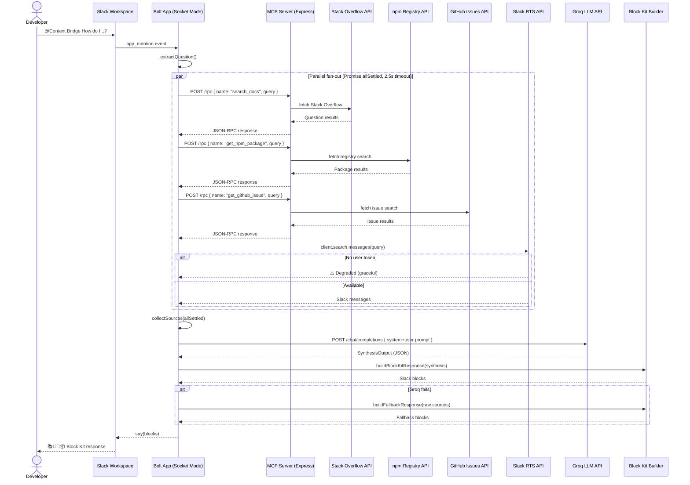

# Context Bridge — Architecture

## High-Level Flow



## System Architecture

```
┌─────────────────────────────────────────────────────────┐
│                    Render (single host)                   │
│                                                          │
│  ┌──────────────────────┐    ┌──────────────────────┐    │
│  │    Slack App (Bolt)   │    │     MCP Server        │   │
│  │  ┌────────────────┐   │    │  ┌────────────────┐   │   │
│  │  │ app-mention.ts │   │    │  │  search-docs   │   │   │
│  │  │ (orquestrador) │───┼────┼─▶│ get-npm-package│   │   │
│  │  │                │   │    │  │ get-github-issue│  │   │
│  │  │ synthesis/     │   │    │  └────────────────┘   │   │
│  │  │ block-kit/     │   │    └──────────────────────┘   │   │
│  │  │ rts/           │   │          :4000/$PORT         │   │
│  │  └────────────────┘   │                              │
│  │   Socket Mode :3000   │                              │
│  └──────────────────────┘                               │
└─────────────────────────────────────────────────────────┘
```

## Data Contracts (Zod)

```
shared/contracts/
├── tools.ts          DocResult | NpmPackageResult | GithubIssueResult | SlackMessageResult
└── synthesis.ts      SynthesisInput { question, sources } → SynthesisOutput { summary, sections[] }
```

## Degradation Strategy

| Source failure | Behavior |
|---------------|----------|
| Stack Overflow timeout | ⚠️ Documentation — No data available |
| Slack RTS unavailable | ⚠️ Slack — No data available (requires user token) |
| GitHub rate limited | ⚠️ GitHub — No data available |
| npm API error | ⚠️ npm — No data available |
| All 4 sources fail | "Could not find information from any source" |
| Groq synthesis fails | Show raw source results with "View source" buttons |

## Technology Stack

| Layer | Technology |
|-------|-----------|
| Runtime | Node.js 24 + TypeScript (strict) |
| Monorepo | pnpm workspaces (3 packages) |
| Slack Framework | Bolt for JavaScript (Socket Mode) |
| MCP Server | Express 5 + JSON-RPC 2.0 |
| Validation | Zod (shared contracts) |
| AI Synthesis | Groq API (Llama 3.1, JSON mode) |
| Testing | Vitest (50 tests) |
| Deployment | Render + UptimeRobot |
