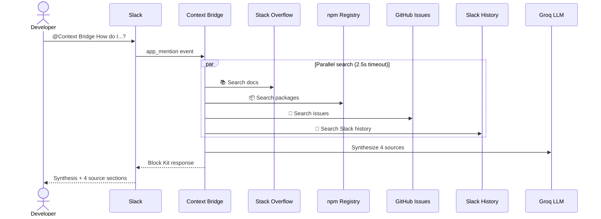

# Context Bridge

> AI-powered Slack agent that answers developer questions by searching 4 sources in parallel and synthesizing a single, structured response.

**Built for the Slack Agent Builder Challenge 2026** — New Slack Agent track.

---

## Quick start

1. **Install** the app in your Slack workspace
2. **Mention** `@Context Bridge` with a question

```
@Context Bridge How do we handle error boundaries in React?
```

3. **Read** the synthesized answer — Block Kit with 4 source sections 📚💬🐙📦

---

## How it works



## Sources

| Source | API | Real data | Degradation |
|--------|-----|-----------|-------------|
| 📚 Documentation | Stack Exchange API | Real Q&A results | ⚠️ if empty |
| 💬 Slack History | Slack RTS API | Requires user token | ⚠️ gracefully |
| 🐙 GitHub Issues | GitHub Issues API | Real issues | ⚠️ if rate-limited |
| 📦 npm Packages | npm Registry API | Real packages | ⚠️ if empty |

## Demo

Try these:

| Question | Expected result |
|----------|-----------------|
| `@Context Bridge How do we handle error boundaries in React?` | 4 sources + synthesis → full Block Kit with emoji sections |
| `@Context Bridge How does `useEffect` work?` | Stack Overflow + GitHub + npm results |
| `@Context Bridge ¿cómo implementar flubber architecture con microservicios?` | All sources degrade → shows graceful ⚠️ and fallback |

## Architecture

```
context-bridge/
├── slack-app/           # Bolt app (Socket Mode)
│   ├── src/
│   │   ├── app.ts                   # Entry point
│   │   ├── events/app-mention.ts    # Main handler
│   │   ├── synthesis/index.ts       # Groq AI synthesis
│   │   ├── block-kit/response.ts    # Block Kit builder
│   │   └── rts/search.ts            # Slack RTS client
│   └── __tests__/                   # 26 tests
├── mcp-server/          # MCP tools (Express + JSON-RPC 2.0)
│   ├── src/tools/
│   │   ├── search-docs.ts           # Stack Overflow
│   │   ├── get-npm-package.ts       # npm registry
│   │   └── get-github-issue.ts      # GitHub Issues
│   └── __tests__/                   # 24 tests
├── shared/              # Zod contracts
│   └── contracts/
│       ├── tools.ts                 # Tool I/O schemas
│       └── synthesis.ts             # Synthesis schemas
├── manifest.json        # Slack app manifest
└── render.yaml          # Render deployment config
```

## Setup

### Requirements

- **Node.js** 24+ with pnpm
- **Slack workspace** with admin access
- **API keys**: Slack Bot Token, Slack App Token, Groq API Key

### Install

```bash
git clone https://github.com/ezefernandezyf/dev-search-agent.git
cd dev-search-agent
pnpm install
pnpm run build
```

### Environment

Copy `.env.example` to `.env` and fill in your tokens:

| Variable | Required | Source |
|----------|----------|--------|
| `SLACK_BOT_TOKEN` | ✅ | Slack OAuth & Permissions (`xoxb-...`) |
| `SLACK_APP_TOKEN` | ✅ | Slack App-Level Tokens (`connections:write`, `xapp-...`) |
| `GROQ_API_KEY` | ✅ | [console.groq.com](https://console.groq.com/keys) |
| `GITHUB_TOKEN` | Optional | Increases GitHub rate limit from 60 → 5000 req/h |

### Run

```bash
pnpm run start
```

The app connects via **Socket Mode** — no ngrok or public URL needed.

### Deploy

Deploy on Render with `render.yaml` (autodetected on repo connect):

[](https://render.com/deploy)

## Resilience

| Scenario | Behavior |
|----------|----------|
| Source times out (>2.5s) | ⚠️ Degraded — other sources unaffected |
| Source returns error | Retry-once, then ⚠️ with warning |
| All 4 sources fail | "Could not find information from any source." + suggestions |
| Groq synthesis fails | Raw source results as fallback with "View source" buttons |
| Parallel fan-out | `Promise.allSettled` — no single-source failure blocks others |

## Tests

```bash
pnpm test             # 50 tests
pnpm run lint         # ESLint
pnpm run format       # Prettier
pnpm run typecheck    # TypeScript strict
```

---

Built for [Slack Agent Builder Challenge 2026](https://devpost.com/software/context-bridge)
